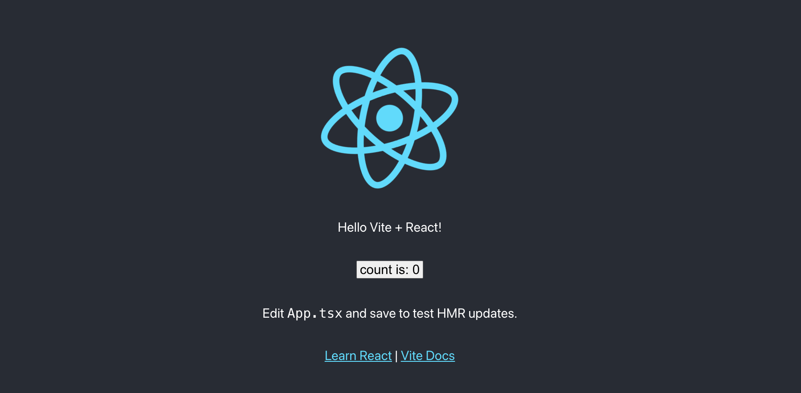

# Vite + React + TypeScript + Tailwind



## Installation

```shell
npx degit kayac-chang/vite-react-tailwind-typescript my-awesome-project
cd my-awesome-project
npm install
```

## Development

```shell
# Start the vite dev server
npm run dev
```

## Building

```shell
# Make a production bundle
npm run build
```

## Preview

```shell
# Preview the production build, you must run `npm run build` first
npm run preview
```
